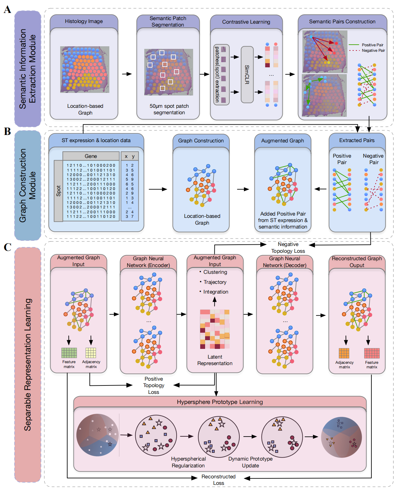

# Separable Spatial Single-cell Transcriptome Representation Learning via Graph Transformer and Hyperspherical Prototype Clustering
This repository contains the source code for the paper "Separable Spatial Single-cell Transcriptome Representation Learning via Graph Transformer and Hyperspherical Prototype Clustering". The code is implemented in PyTorch and PyTorch Geometric.


## Overview
We propose S3RL (Separable Spatial Single-cell Representation Learning), a unified framework that integrates gene expression, spatial coordinates, and histological image features via a graph neural network and hyperspherical prototype-based separable representation learning. In spatial clustering tasks, S3RL improves the Adjusted Rand Index (ARI) by over 52\% on the Nanostring lung cancer dataset and over 26\% on the 10X DLPFC dataset compared to state-of-the-art methods. For multi-slice spatial alignment, S3RL achieves an average ARI improvement of over 65.4\% in partial brain slices and over 48.3\% in complete slices relative to GraphST, highlighting its superior robustness and alignment consistency across heterogeneous spatial inputs. Moreover, S3RL reveals more biologically meaningful ligand-receptor signaling relationships, enhancing the interpretability of cell-cell communication patterns.


## Installation


The S3RL code is packaged as a Python module, and is developed based on the pytorch framework and can be implemented on both GPU and CPU. To run S3RL, all dependencies included in the file `requirement.txt` need to be installed. The next commands guide you through the installation process.

First, create a new conda environment and install the required packages, following the commands below. 
```bash
conda create -n S3RL python=3.7.12
conda activate S3RL
pip install -r requirements.txt
```

*Note that the code is tested with Python 3.7.12 and PyTorch 1.13.0 on a single NVIDIA GeForce RTX 3090 GPU. If you encounter any issues, please check the compatibility of the packages in `requirements.txt` with your Python version. Additionally, different versions of libraries and different GPU devices may lead to varied outcomes, so to reproduce our results, please use the same versions and hardware configuration as specified.*

Then, install the S3RL package by running the following command:
```bash
pip install S3RL --index-url https://pypi.org/simple
```

## Tutorial

**For more datails about training S3RL and realted downsstream tasks and analysis, please refer to the <a href="https://s3rl.readthedocs.io/en/latest/" target="_blank">S3RL online tutorial</a>.**

