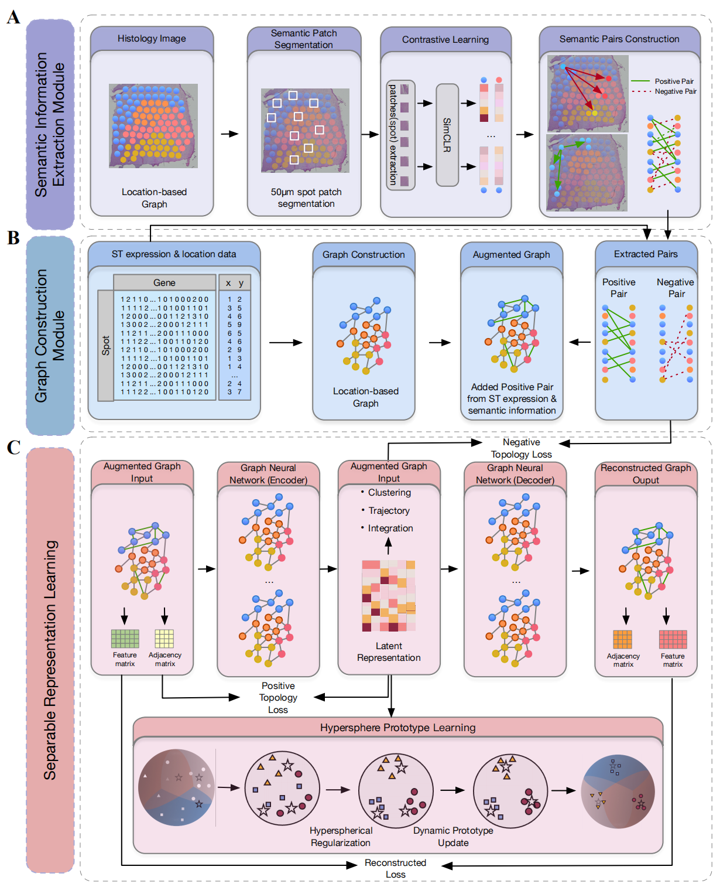

# Separable Spatial Single-cell Transcriptome Representation Learning via Graph Transformer and Hyperspherical Prototype Clustering
This repository contains the source code for the paper "Separable Spatial Single-cell Transcriptome Representation Learning via Graph Transformer and Hyperspherical Prototype Clustering". The code is implemented in PyTorch and PyTorch Geometric.


## Overview
We propose S3RL (Separable Spatial Single-cell Representation Learning), a unified framework that integrates gene expression, spatial coordinates, and histological image features via a graph neural network and hyperspherical prototype-based separable representation learning. In spatial clustering tasks, S3RL improves the Adjusted Rand Index (ARI) by over 52\% on the Nanostring lung cancer dataset and over 26\% on the 10X DLPFC dataset compared to state-of-the-art methods. For multi-slice spatial alignment, S3RL achieves an average ARI improvement of over 65.4\% in partial brain slices and over 48.3\% in complete slices relative to GraphST, highlighting its superior robustness and alignment consistency across heterogeneous spatial inputs. Moreover, S3RL reveals more biologically meaningful ligand-receptor signaling relationships, enhancing the interpretability of cell-cell communication patterns.


## Requirements
After cloning the repository, follow the steps below to install the necessary dependencies. 
#### First, clone the repository with the following command:
```bash
git clone git@github.com:AI4Bread/S3RL.git
cd S3RL
```
#### Then, create a new conda environment and install the required packages:
```bash
conda create -n S3RL python=3.7.12
conda activate S3RL
pip install -r requirements.txt
```

*Note that the code is tested with Python 3.7.12 and PyTorch 1.13.0 on a single NVIDIA GeForce RTX 3090 GPU. If you encounter any issues, please check the compatibility of the packages in `requirements.txt` with your Python version. Additionally, different versions of libraries and different GPU devices may lead to varied outcomes, so to reproduce our results, please use the same versions and hardware configuration as specified.*

#### Download the datasets and place them in the `Data` directory, and make sure the directory structure looks like this:
```
S3RL
├── Data
│   ├── DLPFC
│   │   ├── 151673
│   │   ├── 151674
│   ├── Nanostring
│   ├── Human_Breast_Cancer
│   ├── Mouse_Brain_Anterior
```
The processed datasets are available at the following links:
- [DLPFC]()
- [Nanostring]()
- [Human_Breast_Cancer]()
- [Mouse_Brain_Anterior]()

#### Finally, simply run the following command to start training:
```bash
bash demo_train.sh
```
This will train S3RL on four datasets: DLPFC, Nanostring, Human_Breast_Cancer, and Mouse_Brain_Anterior. After few seconds, you will see the clustering results in the terminal, and the trained model and extracted latent features along with the clustering results will be saved in the `checkpoints` directory.

We also provide the well-trained models for the four datasets. You can download them from the following links:
- [DLPFC]()
- [Nanostring]()
- [Human_Breast_Cancer]()
- [Mouse_Brain_Anterior]()

And the `demo_visualization.ipynb` notebook provides a simple example of how to visualize the clustering results.

**For more datails about training S3RL and realted downsstream tasks and analysis, please refer to the `Tutorial.ipynb` file (In progress and will complete soon).**

## Acknowledgements
Parts of our work are built upon the following repositories: [SiGra](https://github.com/QSong-github/SiGra), [GraphST](https://github.com/JinmiaoChenLab/GraphST/blob/main/README.md?plain=1), [STAGATE](https://github.com/QIFEIDKN/STAGATE). We are very grateful for their contributions.